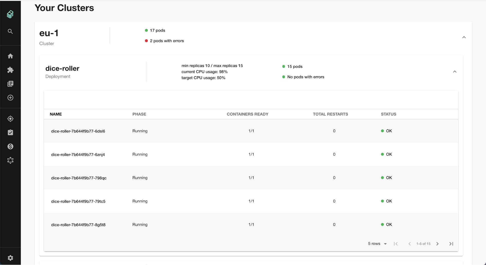

Kubernetes in Devtools is a tool that's designed around the needs of service
owners, not cluster admins. Now developers can easily check the health of their
services no matter how or where those services are deployed — whether it's on a
local host for testing or in production on dozens of clusters around the world.

It will elevate the visibility of errors where identified, and provide drill
down about the deployments, pods, and other objects for a service.

The feature is made up of two plugins:
[`@devtools/plugin-kubernetes`](https://github.com/khulnasoft/devtools/tree/master/plugins/kubernetes)
and
[`@devtools/plugin-kubernetes-backend`](https://github.com/khulnasoft/devtools/tree/master/plugins/kubernetes-backend).

The frontend plugin exposes information to the end user in a digestible way,
while the backend wraps the mechanics to connect to Kubernetes clusters to
collect the relevant information.

## Let's use it!

To get started, first you must [install the Kubernetes plugins](installation.md)
and then [configure them](configuration.md).
