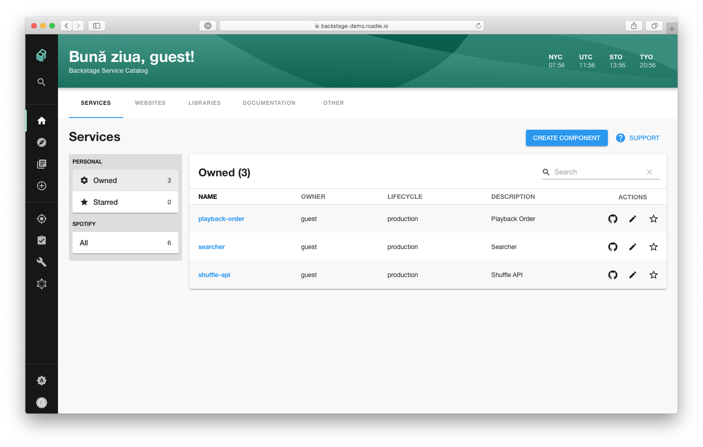

## What is a Software Catalog?

The Devtools Software Catalog is a centralized system that keeps track of
ownership and metadata for all the software in your ecosystem (services,
websites, libraries, data pipelines, etc). The catalog is built around the
concept of [metadata YAML files](descriptor-format.md) stored together with the
code, which are then harvested and visualized in Devtools.


## How it works

Devtools and the Devtools Software Catalog make it easy for one team to manage
10 services — and makes it possible for your company to manage thousands of
them.

More specifically, the Software Catalog enables two main use-cases:

1. Helping teams manage and maintain the software they own. Teams get a uniform
   view of all their software; services, libraries, websites, ML models — you
   name it, Devtools knows all about it.
2. Makes all the software in your company, and who owns it, discoverable. No
   more orphan software hiding in the dark corners of your software ecosystem.

## Getting Started

The Software Catalog is available to browse at `/catalog`. If you've followed
[Getting Started with Devtools](../../getting-started), you should be able to
browse the catalog at `http://localhost:3000`.



## Adding components to the catalog

The source of truth for the components in your software catalog are [metadata YAML files](descriptor-format.md) stored in source control (GitHub, GitHub
Enterprise, GitLab, ...). Repositories can include one or multiple metadata
files. Usually the metadata file is located in the repository root. This is not
a formal requirement & metadata files can be placed anywhere in the repository.

There are 3 ways to add components to the catalog:

1. Manually register components
2. Creating new components through Devtools
3. Integrating with an [external source](external-integrations.md)

### Manually register components

Users can register new components by going to `/create` and clicking the
**REGISTER EXISTING COMPONENT** button:


Devtools expects the full URL to the YAML in your source control. Example:

```bash
https://github.com/khulnasoft/devtools/blob/master/packages/catalog-model/examples/components/artist-lookup-component.yaml
```

_More examples can be found
[here](https://github.com/khulnasoft/devtools/tree/master/packages/catalog-model/examples)._


It is important to note that any kind of software can be registered in
Devtools. Even if the software is not maintained by your company (SaaS
offering, for example) it is still useful to create components for tracking
ownership.

### Creating new components through Devtools

All software created through the
[Devtools Software Templates](../software-templates/index.md) are automatically
registered in the catalog.

### Static catalog configuration

In addition to manually registering components, it is also possible to register
components through [static configuration](../../conf/index.md). For example, the
above example can be added using the following configuration:

```yaml
catalog:
  locations:
    - type: url
      target: https://github.com/khulnasoft/devtools/blob/master/packages/catalog-model/examples/components/artist-lookup-component.yaml
```

More information about catalog configuration can be found
[here](configuration.md).

### Updating component metadata

Teams owning the components are responsible for maintaining the metadata about
them, and do so using their normal Git workflow.


Once the change has been merged, Devtools will automatically show the updated
metadata in the software catalog after a short while.

## Finding software in the catalog

By default the software catalog shows components owned by the team of the logged
in user. But you can also switch to _All_ to see all the components across your
company's software ecosystem. Basic inline _search_ and _column filtering_ makes
it easy to browse a big set of components.


## Starring components

For easy and quick access to components you visit frequently, Devtools supports
_starring_ of components:


## Integrated tooling through plugins

The software catalog is a great way to organize the infrastructure tools you use
to manage the software. This is how Devtools creates one developer portal for
all your tools. Rather than asking teams to jump between different
infrastructure UIs (and incurring additional cognitive overhead each time they
make a context switch), most of these tools can be organized around the entities
in the catalog.


Your Devtools developer portal can be customized by incorporating
[existing open source plugins](https://github.com/khulnasoft/devtools/tree/master/plugins),
or by [building your own](../../plugins/index.md).

## Links

- [[Blog post] Devtools Service Catalog released in alpha](https://devtools.khulnasoft.com/blog/2020/06/22/devtools-service-catalog-alpha)
