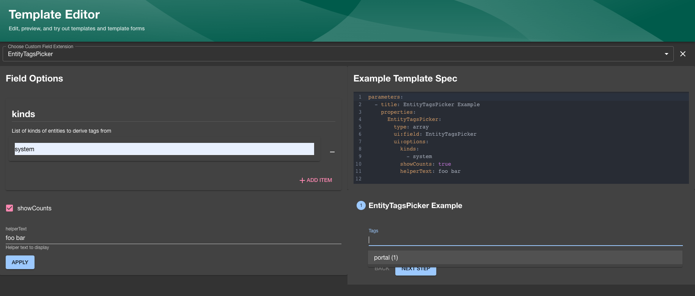

Collecting input from the user is a very large part of the scaffolding process
and Software Templates as a whole. Sometimes the built in components and fields
just aren't good enough, and sometimes you want to enrich the form that the
users sees with better inputs that fit better.

This is where `Custom Field Extensions` come in.

With them you can show your own `React` Components and use them to control the
state of the JSON schema, as well as provide your own validation functions to
validate the data too.

## Creating a Field Extension

Field extensions are a way to combine an ID, a `React` Component and a
`validation` function together in a modular way that you can then use to pass to
the `Scaffolder` frontend plugin in your own `App.tsx`.

You can create your own Field Extension by using the
[`createScaffolderFieldExtension`](https://devtools.khulnasoft.com/docs/reference/plugin-scaffolder.createscaffolderfieldextension)
`API` like below.

As an example, we will create a component that validates whether a string is in the `Kebab-case` pattern:

```tsx
//packages/app/src/scaffolder/ValidateKebabCase/ValidateKebabCaseExtension.tsx
import React from 'react';
import { FieldExtensionComponentProps } from '@devtools/plugin-scaffolder-react';
import type { FieldValidation } from '@rjsf/utils';
import FormControl from '@material-ui/core/FormControl';
import FormHelperText from '@material-ui/core/FormHelperText';
import Input from '@material-ui/core/Input';
import InputLabel from '@material-ui/core/InputLabel';
/*
 This is the actual component that will get rendered in the form
*/
export const ValidateKebabCase = ({
  onChange,
  rawErrors,
  required,
  formData,
}: FieldExtensionComponentProps<string>) => {
  return (
    <FormControl
      margin="normal"
      required={required}
      error={rawErrors?.length > 0 && !formData}
    >
      <InputLabel htmlFor="validateName">Name</InputLabel>
      <Input
        id="validateName"
        aria-describedby="entityName"
        onChange={e => onChange(e.target?.value)}
      />
      <FormHelperText id="entityName">
        Use only letters, numbers, hyphens and underscores
      </FormHelperText>
    </FormControl>
  );
};

/*
 This is a validation function that will run when the form is submitted.
  You will get the value from the `onChange` handler before as the value here to make sure that the types are aligned\
*/

export const validateKebabCaseValidation = (
  value: string,
  validation: FieldValidation,
) => {
  const kebabCase = /^[a-z0-9-_]+$/g.test(value);

  if (kebabCase === false) {
    validation.addError(
      `Only use letters, numbers, hyphen ("-") and underscore ("_").`,
    );
  }
};
```

```tsx
// packages/app/src/scaffolder/ValidateKebabCase/extensions.ts

/*
  This is where the magic happens and creates the custom field extension.

  Note that if you're writing extensions part of a separate plugin,
  then please use `scaffolderPlugin.provide` from there instead and export it part of your `plugin.ts` rather than re-using the `scaffolder.plugin`.
*/

import { scaffolderPlugin } from '@devtools/plugin-scaffolder';
import { createScaffolderFieldExtension } from '@devtools/plugin-scaffolder-react';
import {
  ValidateKebabCase,
  validateKebabCaseValidation,
} from './ValidateKebabCaseExtension';

export const ValidateKebabCaseFieldExtension = scaffolderPlugin.provide(
  createScaffolderFieldExtension({
    name: 'ValidateKebabCase',
    component: ValidateKebabCase,
    validation: validateKebabCaseValidation,
  }),
);
```

```tsx
// packages/app/src/scaffolder/ValidateKebabCase/index.ts

export { ValidateKebabCaseFieldExtension } from './extensions';
```

Once all these files are in place, you then need to provide your custom
extension to the `scaffolder` plugin.

You do this in `packages/app/src/App.tsx`. You need to provide the
`customFieldExtensions` as children to the `ScaffolderPage`.

```tsx
const routes = (
  <FlatRoutes>
    ...
    <Route path="/create" element={<ScaffolderPage />} />
    ...
  </FlatRoutes>
);
```

Should look something like this instead:

```tsx
import { ValidateKebabCaseFieldExtension } from './scaffolder/ValidateKebabCase';
import { ScaffolderFieldExtensions } from '@devtools/plugin-scaffolder-react';

const routes = (
  <FlatRoutes>
    ...
    <Route path="/create" element={<ScaffolderPage />}>
      <ScaffolderFieldExtensions>
        <ValidateKebabCaseFieldExtension />
      </ScaffolderFieldExtensions>
    </Route>
    ...
  </FlatRoutes>
);
```

## Using the Custom Field Extension

Once it's been passed to the `ScaffolderPage` you should now be able to use the
`ui:field` property in your templates to point it to the name of the
`customFieldExtension` that you registered.

Something like this:

```yaml
apiVersion: scaffolder.devtools.khulnasoft.com/v1beta3
kind: Template
metadata:
  name: Test template
  title: Test template with custom extension
  description: Test template
spec:
  parameters:
    - title: Fill in some steps
      required:
        - name
      properties:
        name:
          title: Name
          type: string
          description: My custom name for the component
          ui:field: ValidateKebabCase
  steps:
  [...]
```

## Access Data from other Fields

Custom fields extensions can read data from other fields in the form via the form context. This
is something that we discourage due to the coupling that it creates, but is sometimes still
the most sensible solution.

```tsx
const CustomFieldExtensionComponent = (props: FieldExtensionComponentProps<string[]>) => {
  const { formData } = props.formContext;
  ...
};

const CustomFieldExtension = scaffolderPlugin.provide(
  createScaffolderFieldExtension({
    name: ...,
    component: CustomFieldExtensionComponent,
    validation: ...
  })
);
```

## Previewing Custom Field Extensions

You can preview custom field extensions you write in the Devtools UI using the Custom Field Explorer
(accessible via the `/create/edit` route by default):



In order to make your new custom field extension available in the explorer you will have to define a
JSON schema that describes the input/output types on your field like in the following example:

```tsx
//packages/app/src/scaffolder/MyCustomExtensionWithOptions/MyCustomExtensionWithOptions.tsx
export const MyCustomExtensionWithOptionsSchema = {
  uiOptions: {
    type: 'object',
    properties: {
      focused: {
        description: 'Whether to focus this field',
        type: 'boolean',
      },
    },
  },
  returnValue: { type: 'string' },
};

export const MyCustomExtensionWithOptions = ({
  onChange,
  rawErrors,
  required,
  formData,
}: FieldExtensionComponentProps<string, { focused?: boolean }>) => {
  return (
    <FormControl
      margin="normal"
      required={required}
      error={rawErrors?.length > 0 && !formData}
      onChange={onChange}
      focused={focused}
    />
  );
};
```

```tsx
// packages/app/src/scaffolder/MyCustomExtensionWithOptions/extensions.ts
...
import { MyCustomExtensionWithOptions, MyCustomExtensionWithOptionsSchema } from './MyCustomExtensionWithOptions';

export const MyCustomFieldWithOptionsExtension = scaffolderPlugin.provide(
  createScaffolderFieldExtension({
    name: 'MyCustomExtensionWithOptions',
    component: MyCustomExtensionWithOptions,
    schema: MyCustomExtensionWithOptionsSchema,
  }),
);
```

We recommend using a library like [zod](https://github.com/colinhacks/zod) to define your schema
and the provided `makeFieldSchemaFromZod` helper utility function to generate both the JSON schema
and type for your field props to preventing having to duplicate the definitions:

```tsx
//packages/app/src/scaffolder/MyCustomExtensionWithOptions/MyCustomExtensionWithOptions.tsx
...
import { z } from 'zod';
import { makeFieldSchemaFromZod } from '@devtools/plugin-scaffolder';

const MyCustomExtensionWithOptionsFieldSchema = makeFieldSchemaFromZod(
  z.string(),
  z.object({
    focused: z
      .boolean()
      .optional()
      .describe('Whether to focus this field'),
  }),
);

export const MyCustomExtensionWithOptionsSchema = MyCustomExtensionWithOptionsFieldSchema.schema;

type MyCustomExtensionWithOptionsProps = typeof MyCustomExtensionWithOptionsFieldSchema.type;

export const MyCustomExtensionWithOptions = ({
  onChange,
  rawErrors,
  required,
  formData,
}: MyCustomExtensionWithOptionsProps) => {
  return (
    <FormControl
      margin="normal"
      required={required}
      error={rawErrors?.length > 0 && !formData}
      onChange={onChange}
      focused={focused}
    />
  );
};
```
