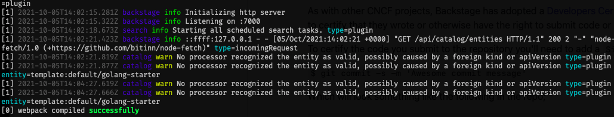

Audience: Developers and Admins

:::note Note
It is not required, although recommended to have a basic understanding of [Yarn](https://www.pluralsight.com/guides/yarn-a-package-manager-for-node-js) and [npm](https://docs.npmjs.com/about-npm) before starting this guide.
:::

## Summary

This guide walks through how to get started creating your very own Devtools customizable app. This is the first step in evaluating, developing on, or demoing Devtools.

By the end of this guide, you will have a standalone Devtools installation running locally with a `SQLite` database and demo content. To be clear, this is not a production-ready installation, and it does not contain information specific to your organization.

:::note Contributors

If you are planning to contribute a new feature or bug fix to the Devtools project, we advise you to follow the [Contributors](https://github.com/khulnasoft/devtools/blob/master/CONTRIBUTING.md#get-started) guide instead to do a repository-based installation.

:::

## Prerequisites

This guide also assumes a basic understanding of working on a Linux based operating system and have some experience with the terminal, specifically, these commands: `npm`, `yarn`.

- Access to a Unix-based operating system, such as Linux, macOS or
  [Windows Subsystem for Linux](https://docs.microsoft.com/en-us/windows/wsl/)
- A GNU-like build environment available at the command line.
  For example, on Debian/Ubuntu you will want to have the `make` and `build-essential` packages installed.
  On macOS, you will want to have run `xcode-select --install` to get the XCode command line build tooling in place.
- An account with elevated rights to install the dependencies
- `curl` or `wget` installed
- Node.js [Active LTS Release](../overview/versioning-policy.md#nodejs-releases) installed using one of these
  methods:
  - Using `nvm` (recommended)
    - [Installing nvm](https://github.com/nvm-sh/nvm#install--update-script)
    - [Install and change Node version with nvm](https://nodejs.org/en/download/package-manager/#nvm)
    - Node 20 is a good starting point, this can be installed using `nvm install lts/iron`
  - [Binary Download](https://nodejs.org/en/download/)
  - [Package manager](https://nodejs.org/en/download/package-manager/)
  - [Using NodeSource packages](https://github.com/nodesource/distributions/blob/master/README.md)
- `yarn` [Installation](https://yarnpkg.com/getting-started/install)
  - Devtools currently uses Yarn 4.4.1, once you've ran `corepack enable` you'll want to then run `yarn set version 4.4.1`
- `docker` [installation](https://docs.docker.com/engine/install/)
- `git` [installation](https://github.com/git-guides/install-git)
- If the system is not directly accessible over your network the following ports
  need to be opened: 3000, 7007. This is quite uncommon, unless you're installing in a container, VM or remote system.

## 1. Create your Devtools App

:::caution

The Devtools app we'll be creating will only have demo data until we set up integrations with your specific data sources!

:::

To install the Devtools Standalone app, we will make use of `npx`. `npx` is a tool that comes preinstalled with Node.js and lets you run commands straight from `npm` or other registries. Before we jump in to running the command, let's chat about what it does.

This command will create a new directory with a Devtools app inside. The wizard will ask you for the name of the app. This name will be created as sub directory in your current working directory.


Inside that directory, it will generate all the files and folder structure
needed for you to run your app.

### General folder structure

Below is a simplified layout of the files and folders generated when creating an app.

```
app
├── app-config.yaml
├── catalog-info.yaml
├── package.json
└── packages
    ├── app
    └── backend
```

- **app-config.yaml**: Main configuration file for the app. See
  [Configuration](https://devtools.khulnasoft.com/docs/conf/) for more information.
- **catalog-info.yaml**: Catalog Entities descriptors. See
  [Descriptor Format of Catalog Entities](https://devtools.khulnasoft.com/docs/features/software-catalog/descriptor-format)
  to get started.
- **package.json**: Root package.json for the project. _Note: Be sure that you
  don't add any npm dependencies here as they probably should be installed in
  the intended workspace rather than in the root._
- **packages/**: Lerna leaf packages or "workspaces". Everything here is going
  to be a separate package, managed by lerna.
- **packages/app/**: A fully functioning Devtools frontend app that acts as a
  good starting point for you to get to know Devtools.
- **packages/backend/**: We include a backend that helps power features such as
  [Authentication](https://devtools.khulnasoft.com/docs/auth/),
  [Software Catalog](https://devtools.khulnasoft.com/docs/features/software-catalog/),
  [Software Templates](https://devtools.khulnasoft.com/docs/features/software-templates/)
  and [TechDocs](https://devtools.khulnasoft.com/docs/features/techdocs/)
  amongst other things.

Now, that we know what it does, let's run it!

```bash
npx @devtools/create-app@latest
```

This may take a few minutes to fully install everything. Don't stress if the loading seems to be spinning nonstop, there's a lot going on in the background.

:::note

If this fails on the `yarn install` step, it's likely that you will need to install some additional dependencies which are used to configure `isolated-vm`. You can find out more in their [requirements section](https://github.com/laverdet/isolated-vm#requirements), and then run `yarn install` manually again after you've completed those steps.

:::

## 2. Run the Devtools app

Your Devtools app is fully installed and ready to be run! Now that the installation is complete, you can go to the application directory and start the app using the `yarn dev` command. The `yarn dev` command will run both the frontend and backend as separate processes (named `[0]` and `[1]`) in the same window.

```bash
cd my-devtools-app # your app name
yarn dev
```



Here again, there's a small wait for the frontend to start up. Once the frontend is built, your browser window should automatically open.

:::tip Browser window didn't open

When you see the message `[0] webpack compiled successfully`, you can navigate directly to `http://localhost:3000` to see your Devtools app.

:::

You can start exploring the demo immediately.


## Recap

This tutorial walked through how to deploy Devtools using the `npx @devtools/create-app@latest` command. That command created a new directory that holds your new Devtools app. That app is currently only configured for development purposes, as it is using an in-memory database and contains demo data.

## Next steps

Choose the correct next steps for your user role, if you're likely to be deploying and managing a Devtools instance for your organization, look through the [Admin](#admin) section. If you're likely to be developing on/for Devtools, take a look through the [Developer](#developer) section.

### Admin

- Deploying to production

  - [Setting up authentication](./config/authentication.md)
  - [Configuring a database](./config/database.md)
  - [Deploying with Docker](../deployment/docker.md)
  - [Deploying with Kubernetes](../deployment/k8s.md)

- Configuring Devtools

  - [Adding plugins](./configure-app-with-plugins.md)
  - [Customizing the theme](./app-custom-theme.md)
  - [Populating the homepage](./homepage.md)

### Developer

- Using your Devtools instance
  - [Logging into Devtools](./logging-in.md)
  - [Register a component](./register-a-component.md)
  - [Create a new component](./create-a-component.md)

Share your experiences, comments, or suggestions with us:
[on discord](https://discord.gg/devtools-687207715902193673), file issues for any
[feature](https://github.com/khulnasoft/devtools/issues/new?labels=help+wanted&template=feature_template.md)
or
[plugin suggestions](https://github.com/khulnasoft/community-plugins/issues/new/choose),
or
[bugs](https://github.com/khulnasoft/devtools/issues/new?labels=bug&template=bug_template.md)
you have, and feel free to
[contribute](https://github.com/khulnasoft/devtools/blob/master/CONTRIBUTING.md)!
