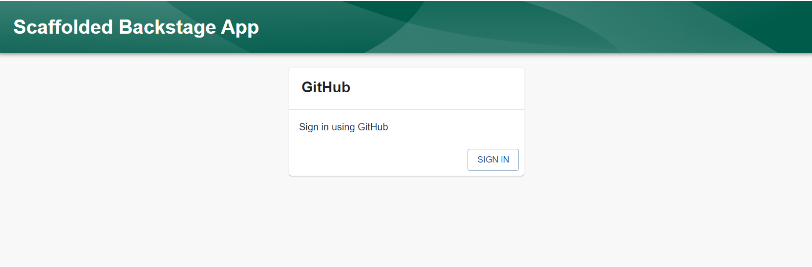

Audience: All

## Summary

This guide will provide a quick tutorial on how to log in to your Devtools instance. It should be used as both an introduction to Devtools's authentication system as well as a debugging guide for any issues you may have while logging in.

## Prerequisites

You should have already [have a standalone app](./index.md) and completed the GitHub OAuth app setup defined in [the authentication tutorial](./config/authentication.md).

## 1. Login to Devtools

Run your Devtools app with `yarn dev`. Navigate to `http://localhost:3000`.

If you're not already logged in, you should see a login screen like this,

To login, you should choose the "GitHub" provider and click the "Sign in" button. This will redirect you to a GitHub OAuth page. Verify that the scopes mentioned on that page match the setup you did in [the authentication tutorial](./config/authentication.md). Once you click "Confirm", you will be brought back to the Devtools interface and signed in!

If you are already logged in, you will be automatically brought to your Devtools instance.

## 2. Verify that you're logged in

Once you've logged in, find the "Settings" item in the navigation bar to the left. Click it and you will see your profile. If you see your profile picture and name from GitHub here, congratulations! You've successfully set up a GitHub authentication integration.

<!-- Would like to have more FAQs here for help instead of funneling to Discord -->

If you don't see your profile picture and name, check that you followed all of the steps in [the authentication tutorial](./config/authentication.md). If you have, search for similar issues on [the Discord server](https://discord.gg/devtools-687207715902193673).
