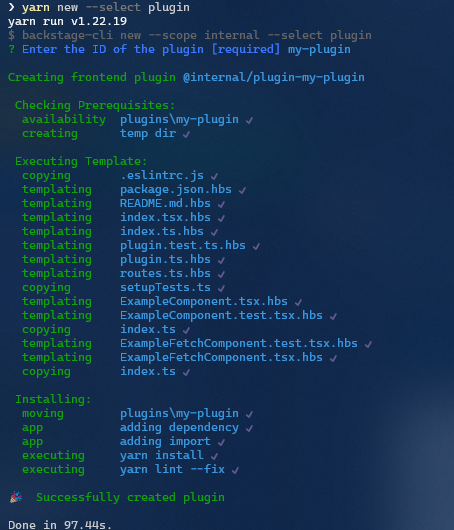
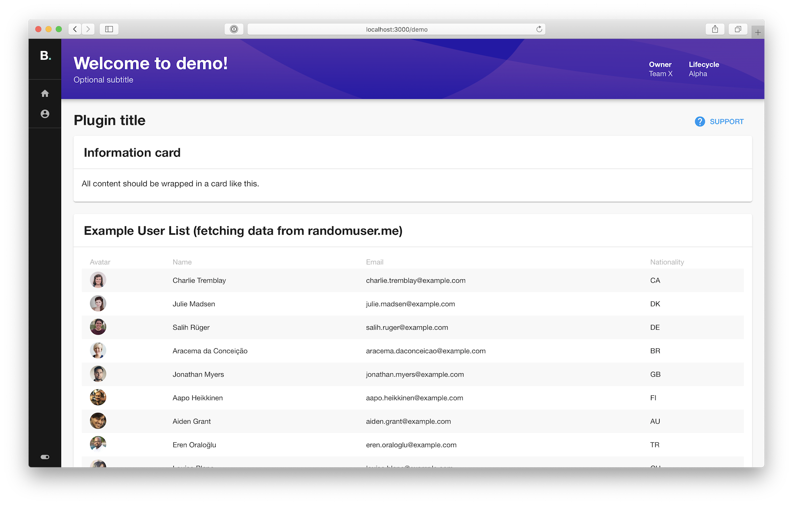
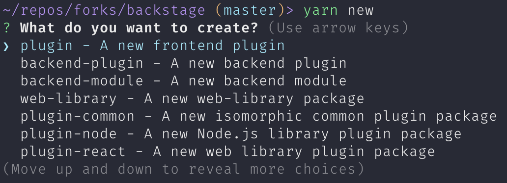

A Devtools Plugin adds functionality to Devtools.

## Create a Plugin

To create a new frontend plugin, make sure you've run `yarn install` and installed
dependencies, then run the following on your command line (a shortcut to
invoking the
[`devtools-cli new --select plugin`](../tooling/cli/03-commands.md#new))
from the root of your project.

```bash
yarn new --select plugin
```



This will create a new Devtools Plugin based on the ID that was provided. It
will be built and added to the Devtools App automatically.

> If the Devtools App is already running (with `yarn start` or `yarn dev`) you
> should be able to see the default page for your new plugin directly by
> navigating to `http://localhost:3000/my-plugin`.



You can also serve the plugin in isolation by running `yarn start` in the plugin
directory. Or by using the yarn workspace command, for example:

```bash
yarn workspace @devtools/plugin-my-plugin start # Also supports --check
```

This method of serving the plugin provides quicker iteration speed and a faster
startup and hot reloads. It is only meant for local development, and the setup
for it can be found inside the plugin's `dev/` directory.

### Other Plugin Library Package Types

There are other plugin library package types that you can chose from. To be able to
select the type when you create a new plugin just run: `yarn new`. You'll then be asked
what type of plugin you wish to create like this:


