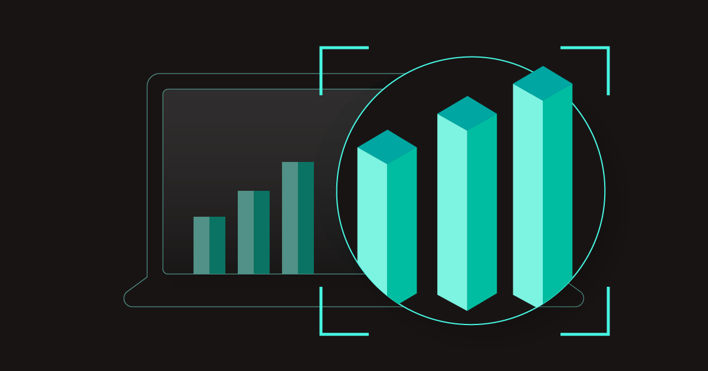

---
# prettier-ignore
title: FYI 📣 The Plugin Analytics API
author: Eric Peterson, Spotify
authorURL: https://github.com/iamEAP
authorImageURL: https://avatars.githubusercontent.com/u/3496491?v=4
---

**TL;DR** If you didn't know, now you know: the Devtools plugin analytics API is here to help you understand how developers in your organization are using Devtools.



{/* truncate */}

## What is the plugin analytics API?

The plugin analytics API is a [utility api](https://devtools.khulnasoft.com/docs/api/utility-apis) available by default in every Devtools instance, intended to bridge the gap between the needs of Devtools integrators and plugin developers. While Devtools integrators want visibility into the plugins they’ve installed, they lack the power to instrument those plugins. And although plugin developers have the power to instrument plugins, they can’t do so without a single, vendor-agnostic way to track events. Enter: the plugin analytics API.

While “analytics” as a concept can be broad, the goal of the API is narrowly focused: empower those deploying Devtools to understand usage of their instance. The plugin analytics API isn’t designed to solve for observability use-cases like tracing, logging, performance monitoring, error metrics, or alerting. Rather, the API is designed to capture and quantify real user interactions, which can form the basis for metrics like daily active users, top plugins, and more.

## Start collecting data

Devtools core (and a few other plugins) are already instrumented with [key events](https://devtools.khulnasoft.com/docs/plugins/analytics#key-events) that are ready for you to start collecting and analyzing.

The simplest way to get started is to use one of the [supported analytics tools](https://devtools.khulnasoft.com/docs/plugins/analytics#supported-analytics-tools) and install its provided API implementation like you would any other utility API. For example:

```tsx
// packages/app/src/apis.ts
import {
  analyticsApiRef,
  configApiRef,
  identityApiRef,
} from '@devtools/core-plugin-api';
import { GoogleAnalytics } from '@devtools/plugin-analytics-module-ga';

export const apis: AnyApiFactory[] = [
  // Instantiate and register the GA Analytics API Implementation.
  createApiFactory({
    api: analyticsApiRef,
    deps: { configApi: configApiRef, identityApi: identityApiRef },
    factory: ({ configApi, identityApi }) =>
      GoogleAnalytics.fromConfig(configApi, {
        identityApi,
      }),
  }),
];
```

If your chosen analytics tool doesn’t have an integration yet, you can write a custom integration by [following these instructions](https://devtools.khulnasoft.com/docs/plugins/analytics#writing-integrations). (And if you’re integrating with a publicly available analytics service, as opposed to a custom in-house system, why not [consider contributing it back to the community](https://devtools.khulnasoft.com/docs/plugins/create-a-plugin)?)

## Instrument plugins

While some key events are already instrumented, there may be important actions in open source plugins that are un-instrumented, not to mention in your custom, InnerSource plugins. Luckily, the plugin analytics API can be leveraged by open source and InnerSource plugins all the same.

To capture an event, invoke the `useAnalytics()` react hook and call the function it returns when the user performs the action you wish to track (e.g. merging a pull request):

```tsx
import { useAnalytics } from '@devtools/core-plugin-api';

const analytics = useAnalytics();
analytics.captureEvent('merge', pullRequestName);
```

Don’t worry about having to stuff additional levels of detail into just the event action and subject, you can provide extra dimensional data on the `attributes` property, as well as a primary metric on the `value` property, like this:

```tsx
analytics.captureEvent('merge', pullRequestName, {
  value: pullRequestAgeInMinutes,
  attributes: {
    org: orgName,
    repo: repoName,
  },
});
```

In situations where your plugin is tracking multiple events and you want all of those events to share common dimensional data, you can use the `<AnalyticsContext>`. Every event captured in child components underneath this context automatically inherits the values you set:

```tsx
import { AnalyticsContext } from '@devtools/core-plugin-api';

<AnalyticsContext attributes={{ vcsProvider: 'github' }}>
  {children}
</AnalyticsContext
```

In fact, Devtools core uses an `<AnalyticsContext>` to automatically decorate every event with a corresponding plugin ID and an extension name in order to facilitate plugin-level analysis.

While the above should be enough to get you going, don’t forget to check out [the complete guide to event capture](https://devtools.khulnasoft.com/docs/plugins/analytics#capturing-events), which covers event naming considerations, testing, and more.

## Get involved

If you didn’t know, now you know! If you’re passionate about data and want to help push the Devtools analytics ecosystem forward, join us in the [#analytics channel on discord](https://discord.com/channels/687207715902193673/1007303347914690610), contribute [integration ideas](https://github.com/khulnasoft/devtools/issues/new?assignees=&labels=plugin&template=plugin_template.md&title=%5BAnalytics+Module%5D+THE+ANALYTICS+TOOL+TO+INTEGRATE), or [suggest a new analytics event](https://github.com/khulnasoft/devtools/issues/new?assignees=&labels=enhancement&template=feature_template.md&title=[Analytics%20Event]:%20THE+EVENT+TO+CAPTURE).
