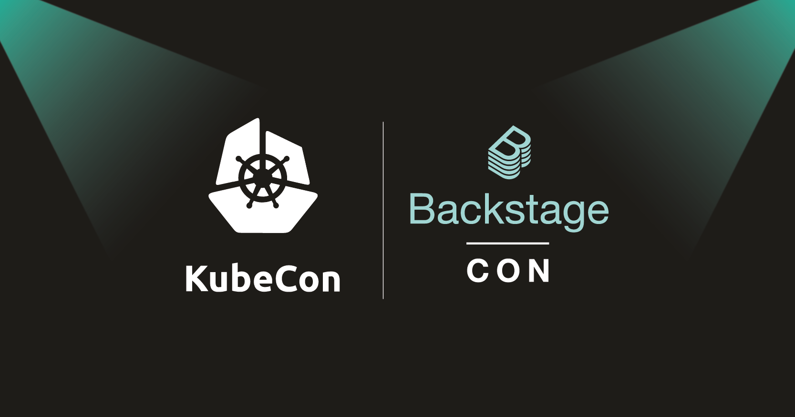
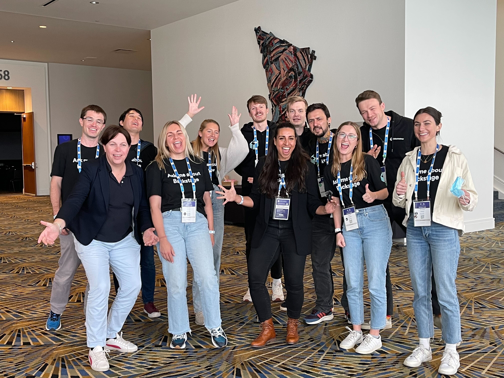
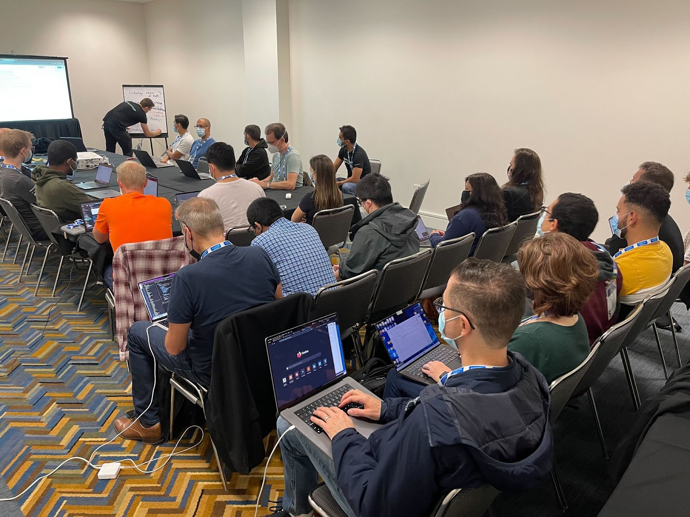
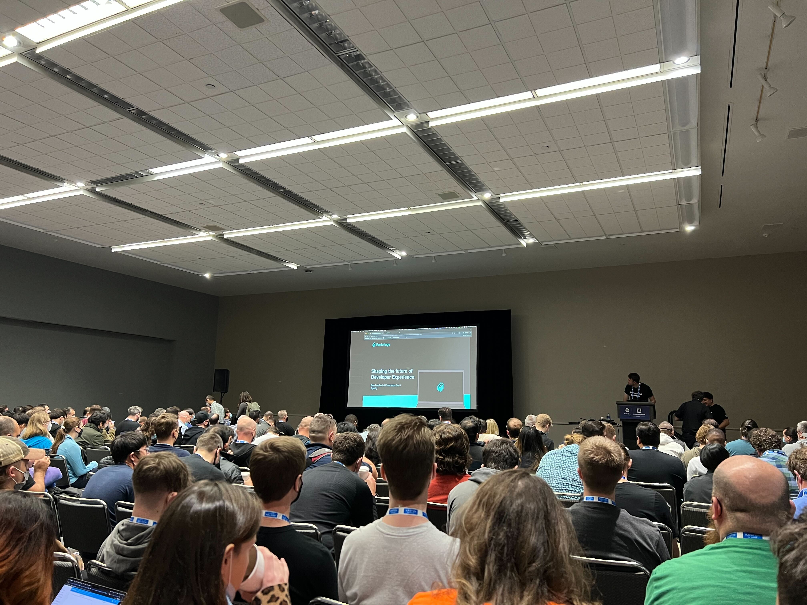

## ICYMI: DevtoolsCon & KubeCon NA 2022 Recap

What an action-packed and memorable week for the Devtools community meeting up IRL at KubeCon North America 2022 in (unseasonably warm and sunny) Detroit. Let’s see what the community was up to:

### DevtoolsCon: A full day of nothing but Devtools

We started the week off strong, packing a ballroom for [DevtoolsCon](https://events.linuxfoundation.org/devtoolscon-north-america/) on Monday. It was a smorgasbord of some of our active community members at the first official Devtools conference — as well as some new faces interested in learning more about Devtools! To welcome us, Roadie’s [Martina Iglesias Fernandez](https://github.com/martina-if) and Spotify’s [Suzanne Daniels](https://github.com/suuus) took center stage. Next up, we listened to three keynotes from the event’s top sponsors: Roadie’s [David Tuite](https://github.com/dtuite) enlightened us on how to 10x developer effectiveness for teams, [Dave Zolotusky](https://github.com/dzolotusky) from Spotify discussed developer happiness and [announced](https://www.linkedin.com/posts/spotify-r%26d_devtools-devex-activity-6990305201710587904-SnDQ?utm_source=share&utm_medium=member_desktop) that [Spotify Plugins for Devtools](https://devtools.spotify.com/blog/spotify-plugins-for-devtools/) are launching soon, and [Valentina Alaria](https://www.linkedin.com/in/valentinaalaria/) from VMware Tanzu talked about how to curate the Devtools experience to enable developer velocity. In between some creative snacks (lemon blueberry popcorn, anyone?) and coffee breaks, we heard from adopters including [Telus](https://devtools.spotify.com/blog/building-for-simplicity-TELUS/), [DAZN](https://devtools.spotify.com/blog/adopter-spotlight/dazn/), HP, US Bank, and more on lessons learned through their adoption journeys, we talked about different ways to leverage data within Devtools, and we discussed new ways to customize Devtools for specific adopter needs.

You can watch all the DevtoolsCon sessions, talks, and keynotes [here](https://www.youtube.com/playlist?list=PLj6h78yzYM2OKySsTuiip3BqmdYZQRnSf)!

### Project Meeting: Building a better Devtools together

The following day, the Devtools maintainers hosted a lively project meeting, where we engaged with a lot of folks that had been at DevtoolsCon the day before. Over the course of the meeting, the Devtools community talked through recommended approaches for maintaining your Software Catalog as a source of truth, sourcing internal contributors for organization’s Devtools apps, improving frontend performance in a few plugins, how Devtools maintainers work, and appreciation for the contributions from our community. You can read more detailed notes from the project meeting in the repo [here](https://github.com/khulnasoft/community/blob/main/project-meetings/kubecon-na-2022.md).

### KubeCon: Demos, swag, and standing-room only

And last but not least: three days of [KubeCon North America](https://events.linuxfoundation.org/kubecon-cloudnativecon-north-america/)! At KubeCon, the Devtools team met and greeted so many new faces at our kiosk in the Project Pavilion. We ran demos, answered questions, and handed out lots and lots of SWAG!

Spotify’s [Francesco Corti](https://github.com/fcorti) and core maintainer [Ben Lambert](https://github.com/benjdlambert) took the stage on Wednesday to present the Devtools maintainer talk to a PACKED audience. They discussed how core features of Devtools are changing the way end-user developers interact and manage their ecosystem, and encouraged folks to create the future of developer experience with the rest of the Devtools community. If you missed it, no worries! Their talk track will be posted on the [CNCF YouTube channel](https://www.youtube.com/c/cloudnativefdn).

…and that’s a wrap! What an incredible week. Our growing Devtools community continues to amaze us with its dedication and enthusiasm. We can’t wait to see you all again at KubeCon Europe in The Netherlands! In fact, we’d love to see our adopters give Devtools talks next year (hint, hint). The KubeCon Europe [CFP is open](https://events.linuxfoundation.org/kubecon-cloudnativecon-europe/program/cfp/#overview) until Friday, November 18, 2022.
