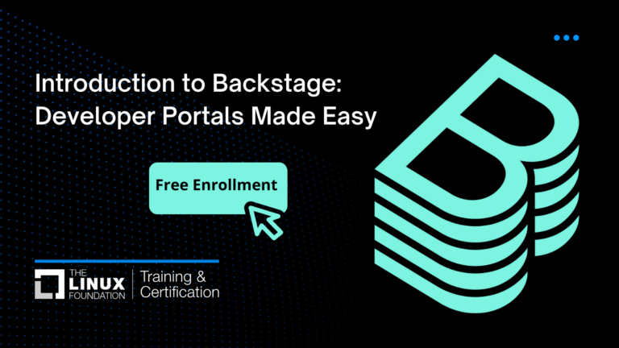

Devtools continues to grow in [popularity and maturity](https://roadie.io/blog/devtools-consolidating-its-role-in-the-cloud-native-ecosystem/), with industry leaders not only adopting the framework but actively participating in the community through contributions and commercial offerings. One of the most recent contributions comes from the Linux Foundation, [launching an introductory course](https://training.linuxfoundation.org/blog/23107/) aimed at DevOps engineers or professionals working on Developer Productivity or Developer Experience. The course is available for free on edX, with a paid option for the certified track.

{/* truncate */}

The course, [Introduction to Devtools: Developer Portals Made Easy (LFS142x)](https://www.edx.org/course/introduction-to-devtools-developer-portals-made-easy), starts discussing the benefits of adopting a Developer Portal. Then, it dives into what is Devtools, its main features (Catalog, Scaffolder, TechDocs), and how to map its capabilities to your organization. At last, it provides tips on how to connect with the community to ease up your adoption journey.

The course author, [Jorge Lainfiesta](https://www.linkedin.com/in/jrlainfiesta/), is a Technical Marketing Manager at [Roadie](https://roadie.io). Jorge has a background in software engineering (PayPal) and digital communication (UCLA). He’s been working around Devtools since it was open sourced by Spotify and co-hosts community initiatives like the Devtools Users Unconference.
