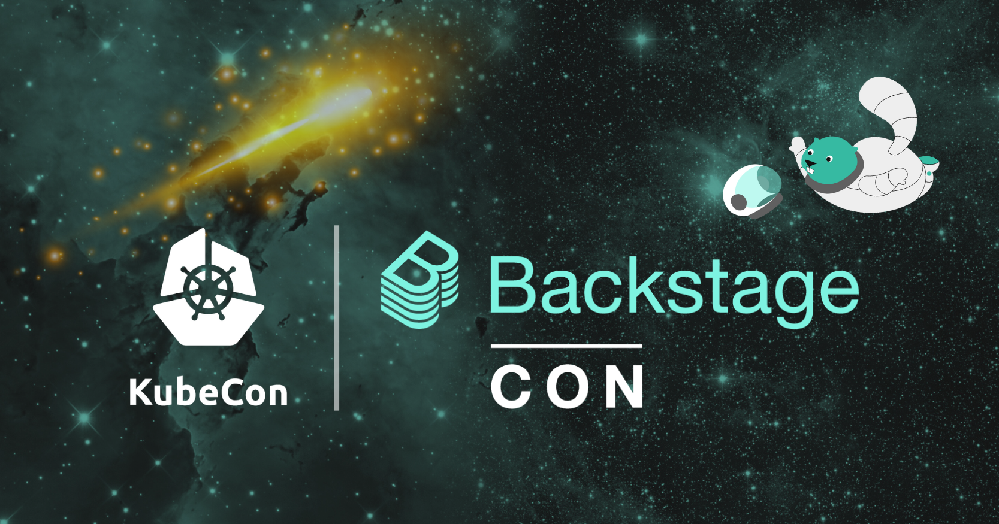
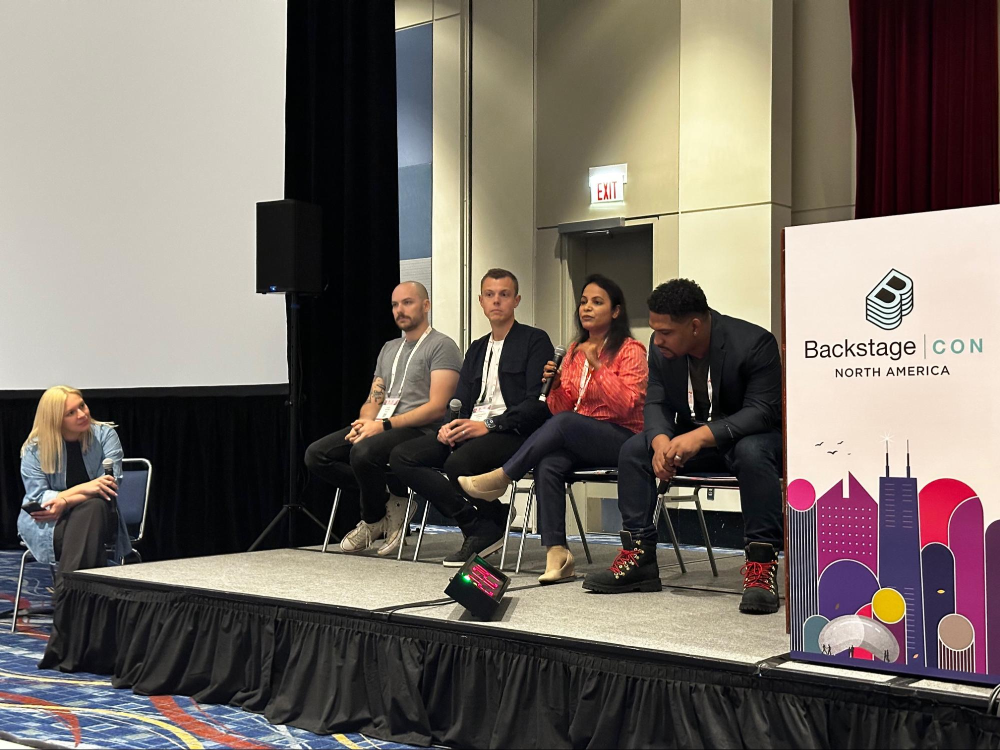
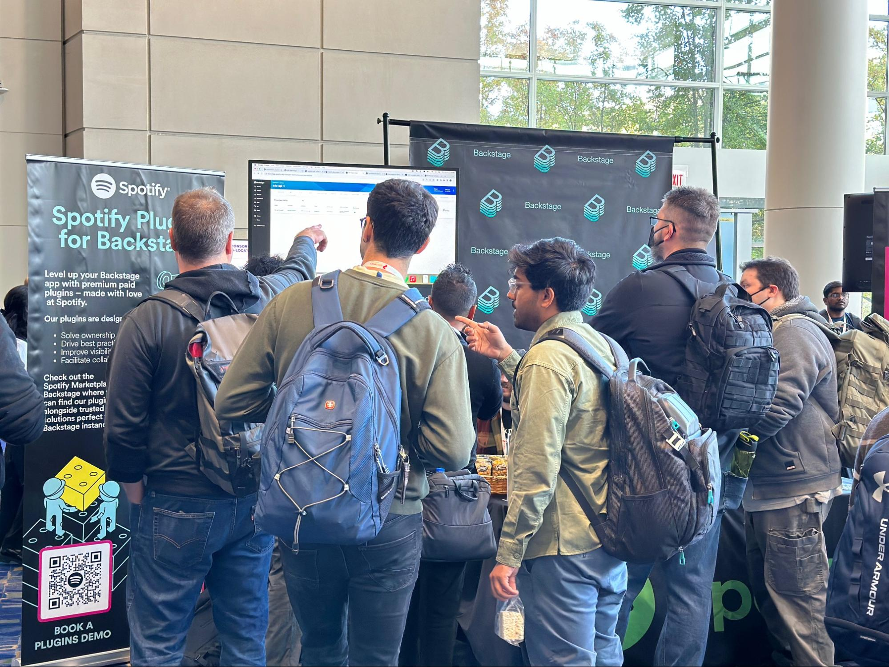
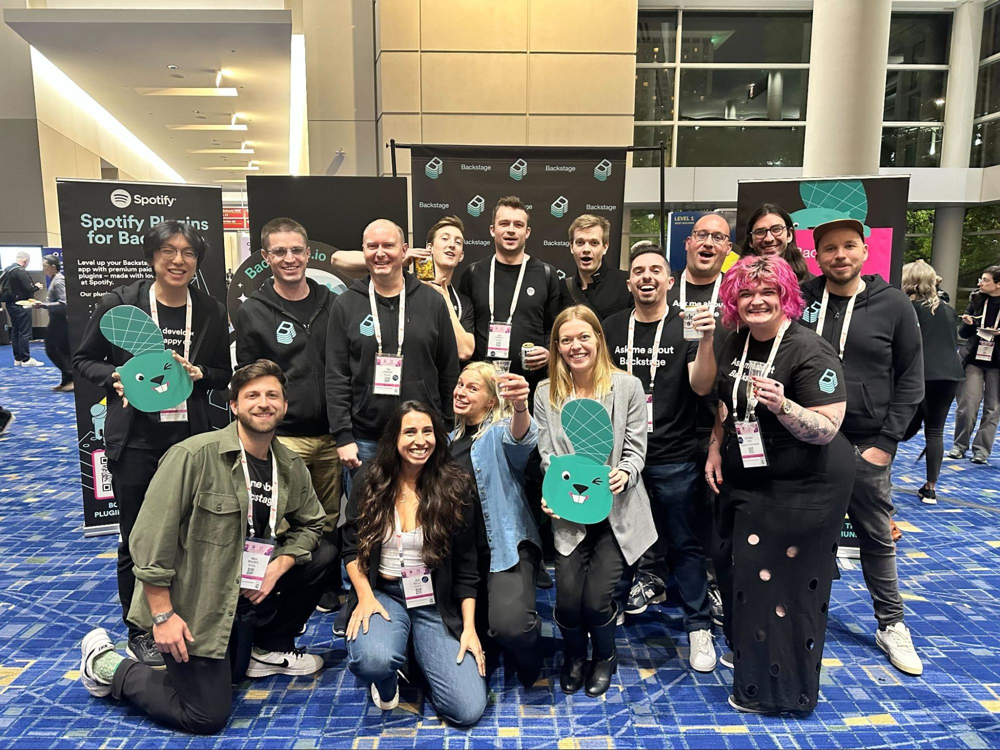
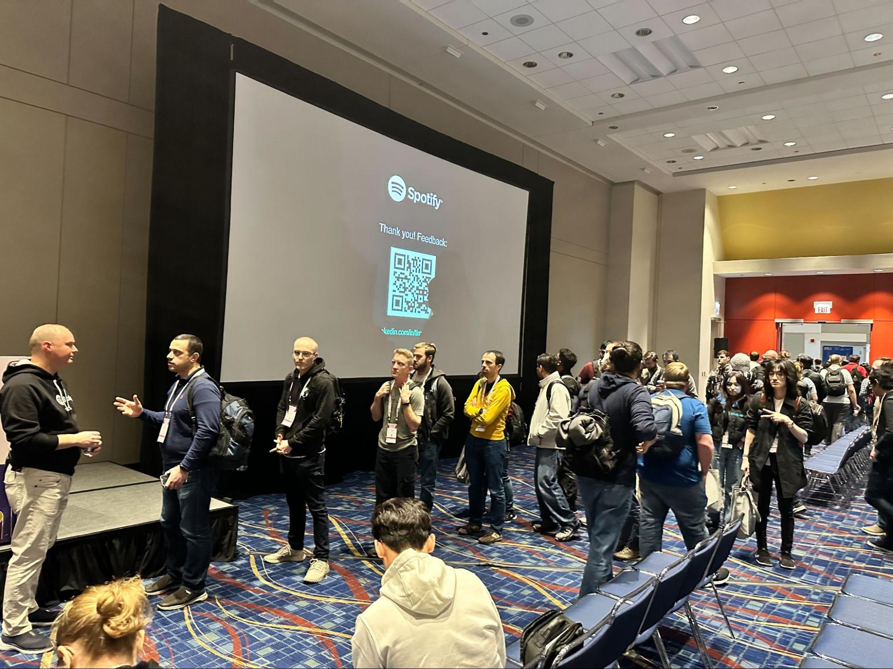
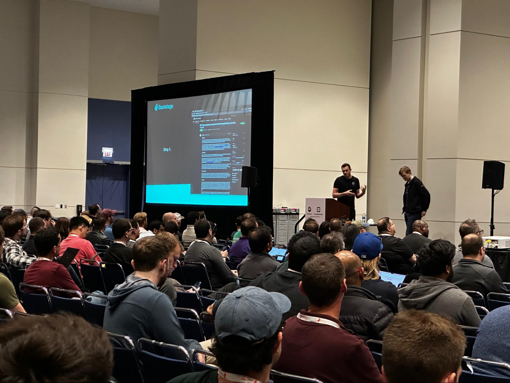
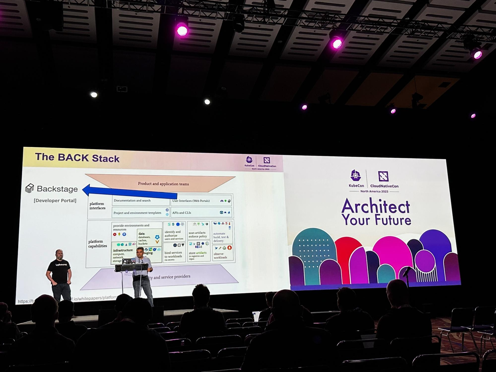

---
# prettier-ignore
title: "Wrap up: DevtoolsCon ‘23, KubeCon + Cloud Native NA"
author: Jorge Lainfiesta, Spotify
authorURL: https://www.linkedin.com/in/jrlainfiesta/
authorImageURL: https://avatars.githubusercontent.com/u/4451393?v=4
---

tl;dr DevtoolsCon North America is officially in the books! We had a blast in Chicago talking about Devtools non-stop throughout the week at both DevtoolsCon and KubeCon. If you weren't able to join us, the [DevtoolsCon talks are available](https://www.youtube.com/playlist?list=PLj6h78yzYM2PxiInfZi2OKu1KluNfbLtc) for replay on the CNCF YouTube channel.
{/* truncate */}

Obviously we're biased, but Devtools was definitely one of the big topics at [KubeCon + CloudNativeCon North America](https://events.linuxfoundation.org/kubecon-cloudnativecon-north-america/) this year. Recently, the CNCF announced that Devtools was the [third fastest-growing project](https://www.cncf.io/blog/2023/10/27/october-2023-where-we-are-with-velocity-of-cncf-lf-and-top-30-open-source-projects/) of the year (up from the fifth last year). And you could confirm it with your own eyes during DevtoolsCon and KubeCon: hundreds of people flocked through the event, talks, and the project booth sharing their enthusiasm and asking more questions about the project.

### DevtoolsCon: A growing community 

With a whopping peak attendance of 400+ people, the crowd nearly doubled from last year,[ taking the center stage of the conference](https://www.forbes.com/sites/janakirammsv/2023/11/14/devtools-project-takes-center-stage-at-kubecon-north-america-2023/?sh=1972303a6539), as reported by Forbes. For some, DevtoolsCon was their first entry point into the community, but the event also boasted lots of  familiar faces, mostly from some of the most mature adopters such as Dynatrace, Lunar, and US Bank. We also got to hear from new voices in the community like Comcast and Grafana Labs.

We hear a lot of great questions such as:

- How do I make more developers use my developer portal?

- Will generative AI take my Devtools instance to the next level?

- What's all the fuss around the upcoming Declarative Integration in Devtools?

The community got together to discuss these and more questions with exciting talks and debates. The talks were all recorded and are [up on YouTube](https://www.youtube.com/playlist?list=PLj6h78yzYM2PxiInfZi2OKu1KluNfbLtc), so make sure to check them out.

**Driving Devtools adoption**

Growing adoption was top of mind during DevtoolsCon. David Tuite, CEO of Roadie, shared the lessons learned from interviewing 20 adopters, which revealed that the Scaffolder was a prime place to get started when adopting Devtools, as it lets stakeholders get an easily measurable ROI.

Helen Greul, Head of Engineering for Devtools at Spotify, hosted [a panel discussion](https://www.youtube.com/watch?v=Iti5glzYOG8&list=PLj6h78yzYM2PxiInfZi2OKu1KluNfbLtc&index=10) with four adopters that are using Devtools at scale: Twilio, Lunar Bank, US Bank, and Expedia. The crucial role of Devtools in fostering inner sourcing and simplifying new hires onboarding were a few of the subjects covered in the panel.

How adopters are using Devtools was also a highlight of the day. B3, Brazil's Stock Exchange, shared [how they're building their developer portal](https://www.youtube.com/watch?v=FyWCKIVYO7g&list=PLj6h78yzYM2PxiInfZi2OKu1KluNfbLtc&index=14). And from Grafana Labs, we heard how they're using [Devtools along Crossplane to drive GitOps](https://www.youtube.com/watch?v=q-JUWob69Hw&list=PLj6h78yzYM2PxiInfZi2OKu1KluNfbLtc&index=10).

**What's next with Devtools?**

The discussion on how Devtools is evolving was featured in a few talks, through live demos that — remarkably — did not go wrong even once! Ben ([benjdlambert](https://github.com/benjdlambert)) and Patrik ([Rugvip](https://github.com/Rugvip)), core maintainers, presented an introduction to the plans around [Declarative Integration](https://www.youtube.com/watch?v=8hVMNMXXN44&list=PLj6h78yzYM2PxiInfZi2OKu1KluNfbLtc&index=8), which will allow people to install plugins without dealing with TypeScript or React. On the other hand, Djamaile and Mitch, from Spotify, [introduced the upcoming Quickstart](https://www.youtube.com/watch?v=bUdaO9NKXJY&list=PLj6h78yzYM2PxiInfZi2OKu1KluNfbLtc&index=12), a tool from Spotify in private-beta that will allow anyone to get started with Devtools through a GUI in a few steps.

**A thriving community**

People gathered outside the conference room where DevtoolsCon was happening to catch up with each other and learn from the event sponsors. It was great to connect with everyone and talk about how everyone is using Devtools.

### Mom, Devtools is not a phase

The interest from the cloud-native community in Devtools did not waver this year. Instead, the Devtools booth in the KubeCon Project Pavillion saw a nonstop flux of visitors asking more about the project. There were three talks featuring Devtools during KubeCon.

**Devtools talks during KubeCon NA '23**

The first talk touching on Devtools of the schedule was Tim Hansen's ([timbonicus](https://github.com/timbonicus)) "Everything Is Code: Embracing GitOps at Spotify," who achieved rockstar status thanks to his phenomenal insights. The queue to ask questions after the talk's questions was surreal!

Devtools maintainers Ben and Patrik addressed a full-room during their talk “Simplifying Devtools - Breaking the Code Barrier” in which they explained Declarative Integration, how it works and the expected migration path. Declarative Integration will enable adopters to install the plugins they use—and even customize them—without dealing with TypeScript or React.

And to close the event, Ritesh Patel, Nirmata and David Murphy, Upbound, introduced the BACK Stack, which stands for Devtools, Argo, Crossplane, and Kyverno. These four tools make up a powerful combo that can enable self-service workflows secure and scalable. After a great demo, the speakers presented a reference architecture that can help guide an approach to using Devtools to build your platform.

### See you next year!

The next KubeCon Europe is scheduled for March 18-22 in Paris. We're looking forward to meeting you all there! [KubeCon EU](https://events.linuxfoundation.org/kubecon-cloudnativecon-europe/program/cfp/) and[ DevtoolsCon EU](https://events.linuxfoundation.org/kubecon-cloudnativecon-europe/co-located-events/devtoolscon/) are accepting CFPs, submit your proposal now!
